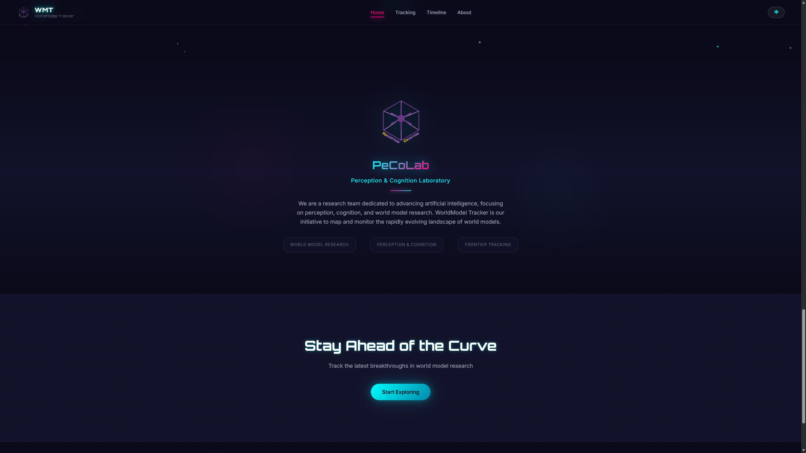

# WorldModel Tracker Deployment Guide

Chinese version: [Deployment.zh-CN.md](Deployment.zh-CN.md)

## Project Summary

The current website project is located at:

`D:\Projects\PeCo\WMT\wmt-website\app`

This is a pure frontend static website built with Vite, React, and TypeScript.

- Local development uses the Vite dev server
- Production output is generated into `dist/`
- Routing uses `HashRouter`
- Data comes from `src/data/worldmodel/*.json`
- No backend service is required

Because of that, whether you develop on Windows or deploy on Ubuntu, the recommended release model is to build static assets and host the generated `dist/` directory.

## Development Team

### PeCoLab


Developed and maintained by PeCoLab (Perception & Cognition Laboratory).

## Deployment Screenshot



If the image is not displayed yet, add your deployment result screenshot at `docs/screenshots/deployment-success.png`.

---

## 1. Full Workflow: Windows Development + Ubuntu Deployment

### 1.1 Local Development on Windows

Recommended environment:

- Node.js 22 LTS
- npm 10+

First confirm that Node.js is installed:

```powershell
node -v
npm -v
```

If the commands do not exist, install Node.js first and reopen the VS Code terminal.

Go to the project directory:

```powershell
cd D:\Projects\PeCo\WMT\wmt-website\app
```

Install dependencies:

```powershell
npm install
```

Start the development server:

```powershell
npm run dev
```

The configured development port is `3000`, so after startup open:

`http://localhost:3000`

If you want to verify the production build locally first:

```powershell
npm run build
npm run preview
```

If `node` or `npm` is installed but still not recognized in PowerShell, run this temporary PATH fix once:

```powershell
$env:Path = "C:\Program Files\nodejs;" + $env:Path
```

---

### 1.2 Deployment on Ubuntu Server

You should not use `npm run dev` as the production runtime on Ubuntu. The recommended process is:

1. Build the project locally or on the server
2. Get the generated static files in `dist/`
3. Host `dist/` with Nginx or another static file server

If you want to build directly on the Ubuntu server:

```bash
cd /path/to/wmt-website/app
npm ci
npm run build
```

After the build completes, you will get:

```bash
dist/
```

Which includes:

- `index.html`
- `assets/`

---

### 1.3 Example: Ubuntu + Nginx

Assume you deploy the build output to:

`/var/www/wmt-website`

First copy the build artifacts:

```bash
sudo mkdir -p /var/www/wmt-website
sudo cp -r dist/* /var/www/wmt-website/
```

Create an Nginx site config:

```nginx
server {
    listen 80;
    server_name your-domain-or-ip;

    root /var/www/wmt-website;
    index index.html;

    location / {
        try_files $uri $uri/ /index.html;
    }
}
```

Enable the site and reload Nginx:

```bash
sudo ln -s /etc/nginx/sites-available/wmt-website /etc/nginx/sites-enabled/wmt-website
sudo nginx -t
sudo systemctl reload nginx
```

If another default site is already enabled, adjust the site file names and symlinks accordingly.

---

### 1.4 A Safer Release Flow

The more robust deployment flow is:

1. Build and verify on Windows locally
2. Upload the generated `dist/` directory to the Ubuntu server

This separates build failures from server configuration failures.

If you want to upload `dist/` to Ubuntu, you can use `scp`:

```bash
scp -r dist/* user@your-server:/var/www/wmt-website/
```

---

## 2. Is There a Difference Between Windows Development and Ubuntu Deployment?

For this project, the main differences are in environment and operations, not business logic.

### 2.1 Short Answer

- Development commands work fine on Windows
- Production deployment is more suitable on Ubuntu
- The codebase itself does not depend on Windows-only capabilities
- As long as the Node.js major version is aligned, the build result should not differ in any meaningful way

### 2.2 Key Differences to Watch

#### Node.js Version

Keep the major Node.js version the same on Windows and Ubuntu. Node.js 22 LTS is recommended.

#### File Name Casing

Ubuntu file systems are usually case-sensitive, while Windows often is not.

For example:

- On Windows, `./components/Navbar` and `./components/navbar` may both appear to work
- On Ubuntu, if the real file name is `Navbar.tsx`, importing `navbar` can fail during build or runtime

#### Line Endings

Windows often uses `CRLF`, while Ubuntu usually uses `LF`. This project is not very sensitive to that today, but it matters if you later add shell scripts.

#### Permissions

Ubuntu deployment requires handling directory permissions, Nginx access, and ownership of the deployed files. Local Windows development usually does not.

---

## 3. Deployment Characteristics of This Project

### 3.1 Routing Strategy

The project uses `HashRouter`, so static deployment is relatively forgiving:

- It does not strongly depend on server-side route rewrites
- Direct static hosting usually works without extra routing rules

### 3.2 Build Commands

The project scripts are:

```json
{
  "scripts": {
    "dev": "vite",
    "build": "tsc -b && vite build",
    "lint": "eslint .",
    "preview": "vite preview"
  }
}
```

Common commands:

- `npm run dev`: start local development
- `npm run build`: create the production build
- `npm run preview`: preview the production build locally
- `npm run lint`: run code quality checks

---

## 4. Recommended Deployment Order

Follow this order:

1. Install Node.js 22 LTS on Windows
2. Run `npm install` locally
3. Run `npm run build` locally
4. Confirm the build completes without errors
5. Upload `dist/` to Ubuntu
6. Serve it with Nginx

---

## 5. Confirmed Facts About the Current Project

- The project is a pure frontend static site
- It has no backend service dependency
- Data files are stored in `src/data/worldmodel/`
- The Vite dev server runs on port `3000`
- Production deployment should be based on the generated `dist/`