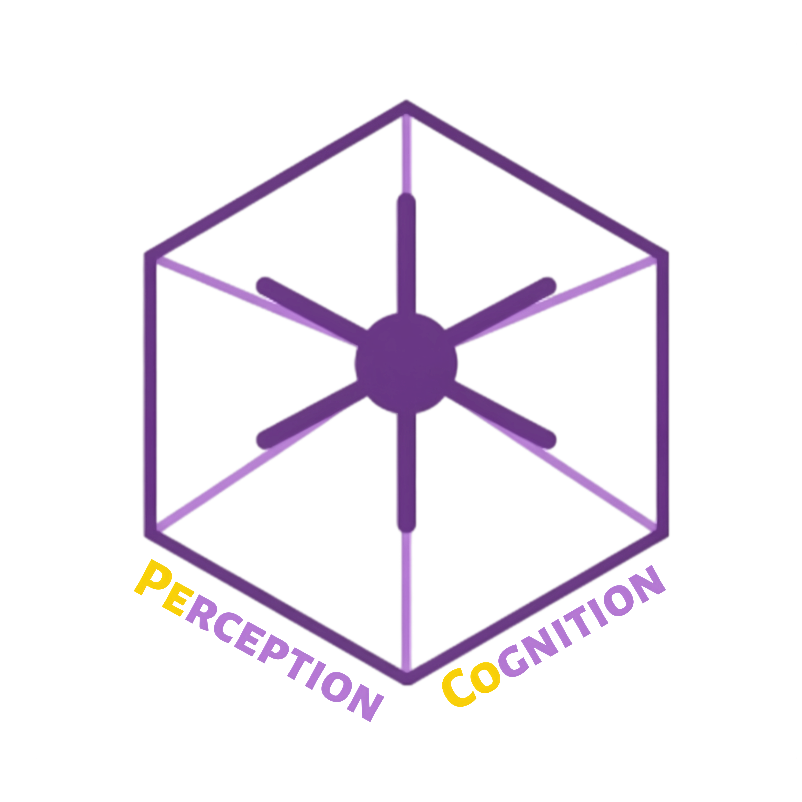
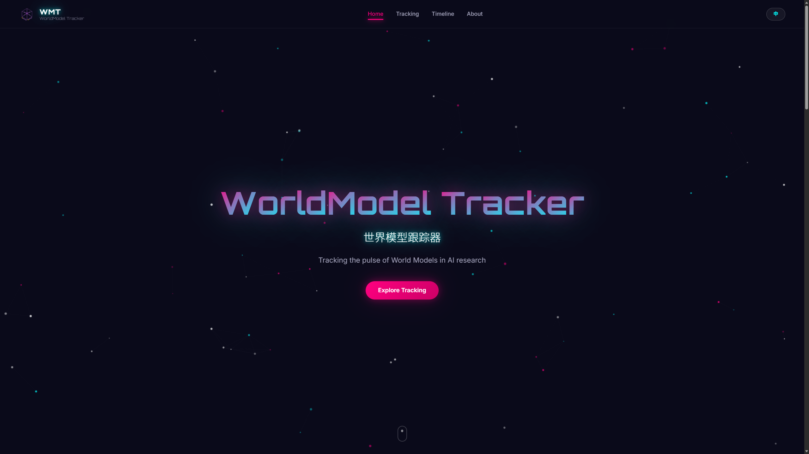
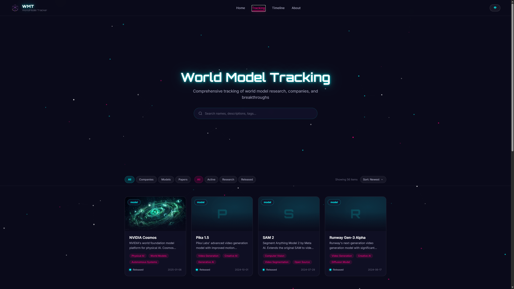
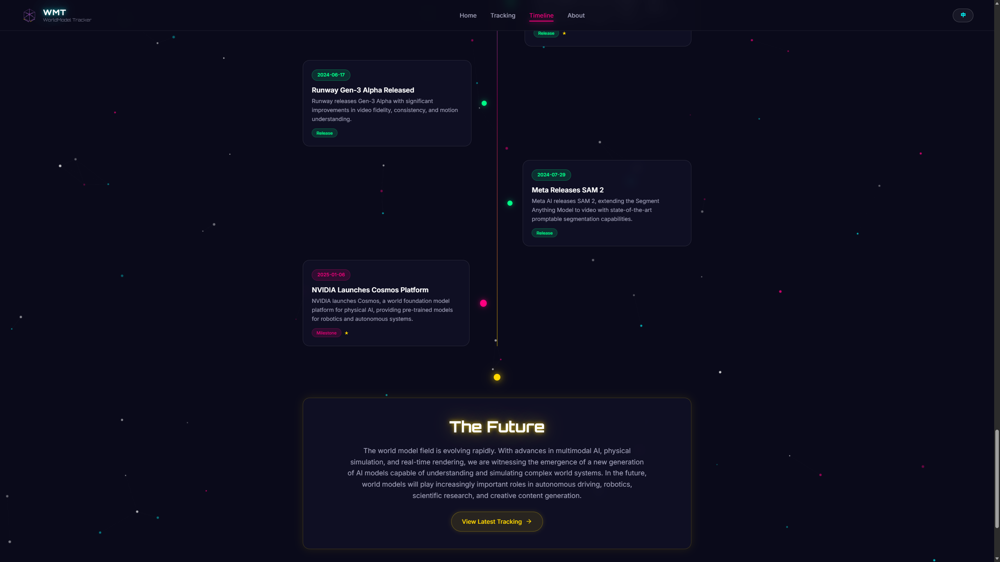

# 世界模型跟踪器


## 版本信息

- 当前版本：0.0.1
- 上一版本：0.0.0
- 前端应用包名：wmt-web
- 变更记录：[CHANGELOG.md](CHANGELOG.md)

## 项目简介

本项目聚焦 AI 世界模型领域的信息整理与可视化展示，面向研究者、开发者和行业观察者，提供统一的双语浏览入口。

当前网站前端基于 Vite + React + TypeScript 构建，使用 HashRouter 进行静态路由，适合直接构建为 dist/ 后部署到 Nginx 或其他静态托管环境。

前端应用在 `wmt-website/app/package.json` 中的包名为 `wmt-web`。

## 开发团队

### PeCoLab



本项目由 PeCoLab（感知与认知实验室）开发与维护。

## 主要功能

- 中英双语界面切换，语言偏好会保存在浏览器本地
- 主页展示世界模型概览、精选项目和最新动态
- Tracking 页面支持按类别、状态、关键词检索和排序
- Timeline 页面展示世界模型领域的发展时间线
- Detail 页面展示单个公司、模型或论文的详情信息
- About 页面介绍项目使命、方法论和统计信息
- 数据以本地 JSON 形式随前端一起发布，无需后端服务

## 站点截图

### 首页预览



### 追踪页预览



### 时间线页预览



如果图片暂未显示，请将对应截图放到 `docs/screenshots/` 目录，并保持文件名一致。

## 技术栈

- React 19
- TypeScript
- Vite 7
- Tailwind CSS
- Framer Motion
- React Router
- Lucide React
- shadcn/ui 风格组件集合

## 项目结构

```text
WMT/
├─ Deployment.md                 # 部署说明
├─ README.md                     # 项目导航
├─ README.zh-CN.md               # 中文说明
├─ README.en.md                  # English documentation
├─ wmt-website/
│  ├─ generate_worldmodel_data.py
│  ├─ worldmodel_data/           # 原始或导出的数据文件
│  └─ app/
│     ├─ package.json
│     ├─ public/
│     └─ src/
│        ├─ components/
│        ├─ contexts/
│        ├─ data/worldmodel/     # 前端实际使用的数据
│        └─ pages/
└─ wmt-website-bak/              # 备份目录
```

## 页面说明

- `/`：主页
- `/tracking`：追踪页，聚合公司、模型和论文
- `/timeline`：发展时间线
- `/about`：关于页面
- `/detail/:id`：详情页

## 数据说明

前端页面当前从 `wmt-website/app/src/data/worldmodel/` 目录读取 JSON 数据，并通过加载器统一聚合。

数据文件包括：

- `companies.json`
- `models.json`
- `papers.json`
- `timeline.json`
- `updates.json`

根目录下的 Python 脚本 `wmt-website/generate_worldmodel_data.py` 用于生成世界模型相关数据。若更新数据源，建议在生成后同步到前端使用的 `src/data/worldmodel/` 目录。

## 本地开发

建议环境：

- Node.js 22 LTS
- npm 10+

进入前端目录：

```powershell
cd D:\Projects\PeCo\WMT\wmt-website\app
```

安装依赖：

```powershell
npm install
```

启动开发服务器：

```powershell
npm run dev
```

默认访问地址：

```text
http://localhost:3000
```

如果当前 PowerShell 无法识别 `node` 或 `npm`，可先临时修复 PATH：

```powershell
$env:Path = "C:\Program Files\nodejs;" + $env:Path
```

## 常用命令

```powershell
npm run dev
npm run build
npm run preview
npm run lint
```

## 生产部署

推荐流程：

1. 在本地执行 `npm run build`
2. 生成静态产物 `dist/`
3. 将 `dist/` 上传到 Ubuntu 服务器
4. 使用 Nginx 或其他静态服务器托管

更完整的部署说明见 [Deployment.zh-CN.md](Deployment.zh-CN.md)。英文版见 [Deployment.en.md](Deployment.en.md)。

## 适用场景

- 世界模型领域研究整理与展示
- AI 技术趋势可视化站点
- 双语静态内容网站模板
- 研究团队或实验室项目主页

## 备注

- 项目当前为纯前端静态站点
- 路由使用 HashRouter，静态部署兼容性较好
- Ubuntu 环境部署时需注意文件路径大小写